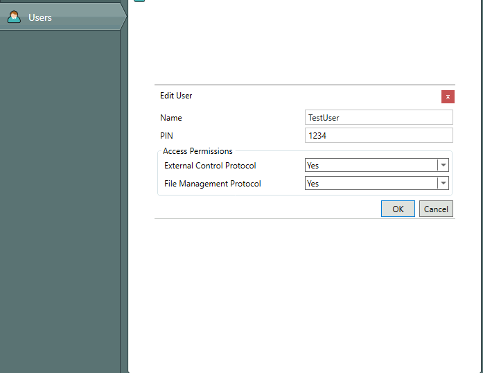

# Q-Sys ide importer

> Write Q-Sys code in your IDE, automatically import to your core

## Installation

Install NodeJS, then:

```bash
git clone https://github.com/patrickgilsf/q-sys-ide-importer.git
```

Install dependencies

```bash
git install
```

### Setup your `init.json` file in `/lib/init.json`

```js
{
  "component": "", //add the name of your component in the Q-Sys file
  "coreIP": "" //add the ip address of the core you are adding code to
}
```

### Setup your Q-Sys file

`init.json` has a `component` property that needs to match the text controller/UCI you are trying to write code for, and "Script Access" has to be set to "All", or "External":


## Authentication

Your Q-Sys core might be hardened with authentication for QRC.
> [!WARNING]
> this is separate from authenticaion on the core itself

Authentication is performed in Q-Sys Administator:


If your core is authenticated, create a file called `.env` at the root of the repo, and add these credentials to the file

```js
QSysUN="TestUser"
QSysPin=1234
```

## Write your code

Write your control code in `/lua/import.lua`
> [!WARNING]
> Make sure you have a control for every instance of `Controls.control` in your code

## Uploading Data

Once your environment is set up properly, open a command line at the root of the repo and run

```js
node app
```

OR you can have it auto run on every save, with

```js
nodemon app
```

## Contributions and issues

Feel free to submit Pull Requests for bug fixes, or feel free to [open up an issue](https://github.com/patrickgilsf/q-sys-ide-importer/issues).
